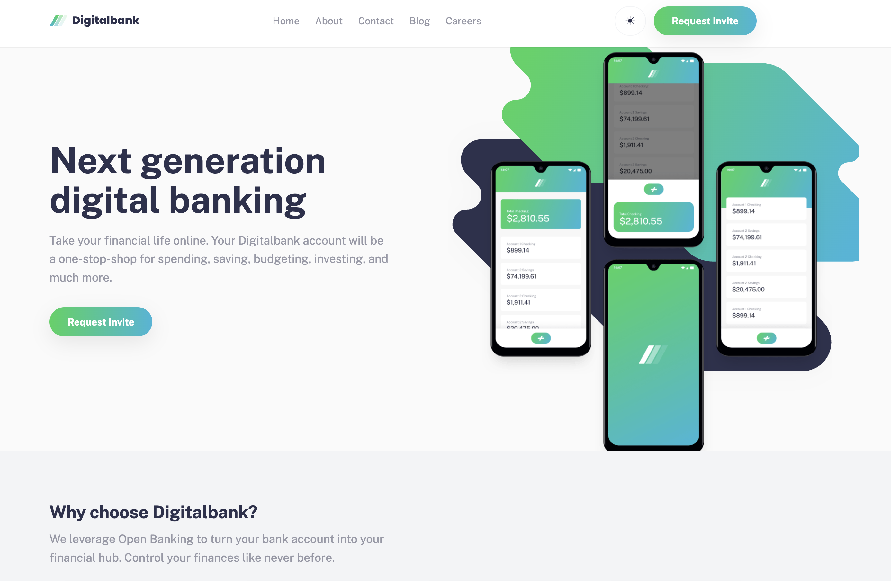

# Frontend Mentor - Digitalbank landing page solution

This is a solution to the [Digitalbank landing page challenge on Frontend Mentor](https://www.frontendmentor.io/challenges/digital-bank-landing-page-WaUhkoDN). Frontend Mentor challenges help you improve your coding skills by building realistic projects.

## Table of contents

- [Overview](#overview)
  - [The challenge](#the-challenge)
  - [Screenshot](#screenshot)
- [My process](#my-process)
  - [Built with](#built-with)
  - [What I learned](#what-i-learned)
  - [Continued development](#continued-development)
  - [Useful resources](#useful-resources)
- [Author](#author)
- [Acknowledgments](#acknowledgments)

## Overview

### The challenge

Users should be able to:

- View the optimal layout for the site depending on their device's screen size
- See hover states for all interactive elements on the page

### Screenshot



## My process

### Built with

- Semantic HTML5 markup
- CSS custom properties
- Flexbox
- CSS Grid
- Mobile-first workflow
- Vanilla JavaScript for navigation, modal, FAQ, and validation

### What I learned

Key takeaways:

- Building a responsive hero with layered `picture` + positioned mockups for art direction.
- Managing mobile navigation with an accessible focus trap and scroll locking.
- Structuring FAQ, testimonials, and pricing cards with reusable grid patterns.
- Toggling themes using `data-theme` tokens and swapping assets (light/dark logo).

```css
[data-theme="dark"] .logo--light-bg {
  display: none;
}
```

### Continued development

- Add analytics hooks for CTA interactions and FAQ opens.
- Improve modal flow with async submit and loading states.
- Refine testimonial slider with swipe/auto-play + reduced-motion support.

### Useful resources

- [MDN ARIA Authoring Practices](https://www.w3.org/WAI/ARIA/apg/) – helpful for focus management patterns.
- [Josh Comeau: CSS Animations and prefers-reduced-motion](https://www.joshwcomeau.com/) – guidance on motion accessibility.

## Author

- Frontend Mentor - [@OluochBen](https://www.frontendmentor.io/profile/OluochBen)
- Twitter - [@Ben_Oluoch1](https://x.com/Ben_Oluoch1)

## Acknowledgments

Thanks to Frontend Mentor for the design brief and assets.
